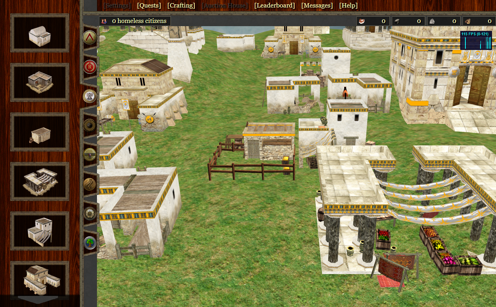
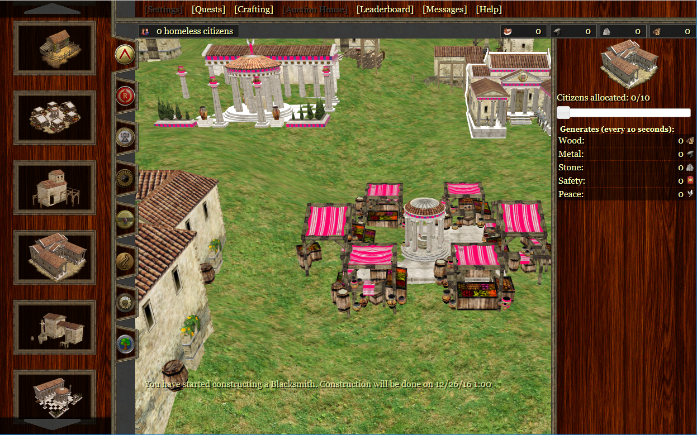
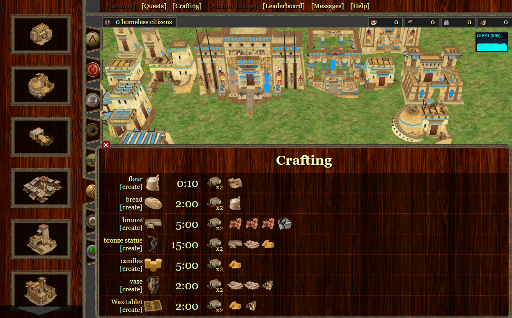
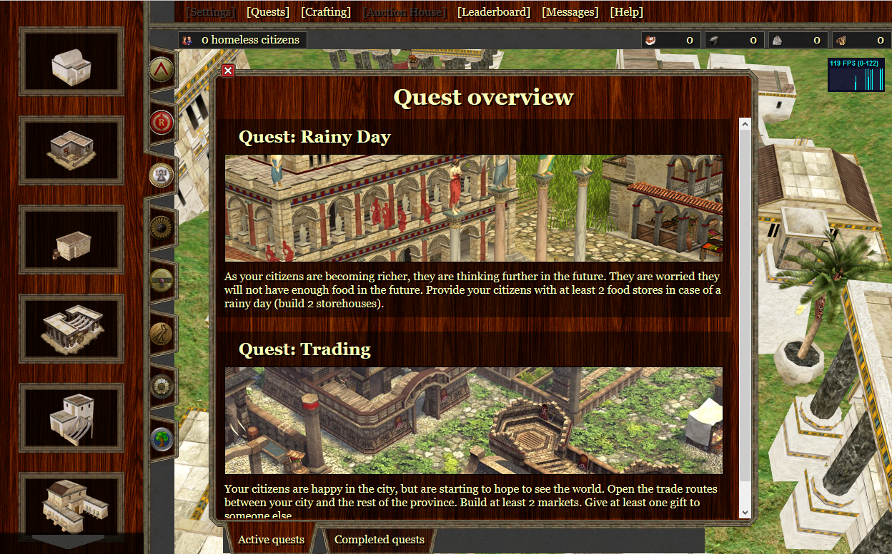

Utopolis 
========

City building game for TU Delft course (IN4302TU)

Utopolis is a multi-player city building game with both individual and collective incentives. Students build structures in their own cities, which together comprise a province.

The setting of the game takes place in a fictional iron age style world. One province corresponds to one class and is composed of cities. The students in the class are divided among these cities based on grouping by the teacher (either random or with an express purpose). The game play revolves around building the city and province to reach certain levels of achievements. Each city is built of structures, which can be built with [an initial stock] of resources when the student has enough citizens, which are awarded by the teacher for desired behavior. A student can then assign citizens to build a structure (using the resources the student has). Structures then produce further resources (except houses, which when built produce one citizen – making houses the only way to increase the number of citizens a student has, other than being rewarded citizens by the teacher). Resources are both tangible (such as brick and wood) and intangible (such as knowledge).

More info
---------

* [game_design.pdf](docs/game_design%20.pdf)
* [technical_documentation.pdf](docs/technical_documentation.pdf)

Screenshots
-----------

